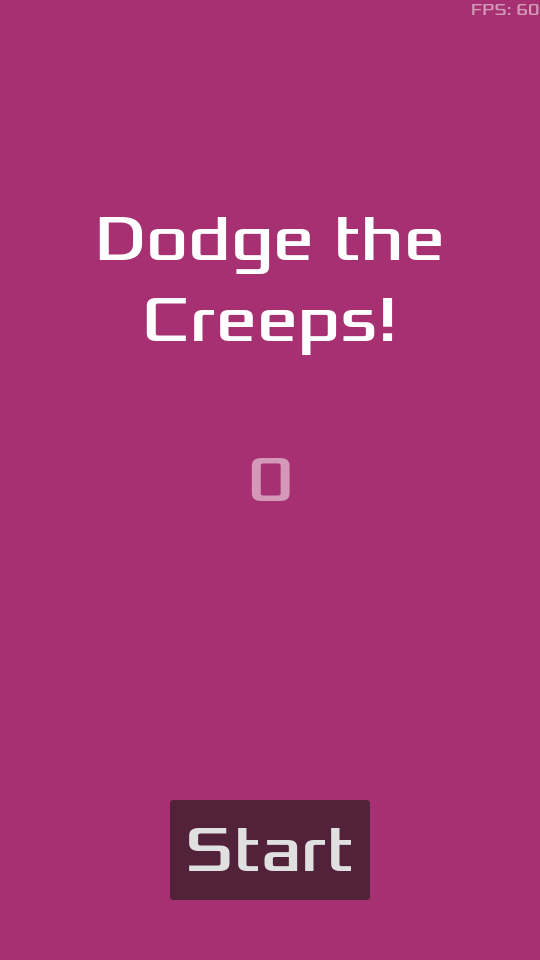

# First 2D Game

## Requirements
- Godot Engine 4.4 or later
- Basic understanding of GDScript

## How to Play
1. Use arrow keys or WASD to move the player
2. Avoid the creeps (enemies) for as long as possible
3. The game ends when you collide with a creep
4. Press the Start button to play again

## Learning Resources
This project is based on the official Godot tutorial. For more information, see:
- [Your first 2D game](https://docs.godotengine.org/en/stable/getting_started/first_2d_game/index.html)
- [Godot Engine Documentation](https://docs.godotengine.org/en/stable/)
- [GDScript Reference](https://docs.godotengine.org/en/stable/tutorials/scripting/gdscript/gdscript_basics.html)

## License
This project is licensed under the MIT License. See the [LICENSE](LICENSE) for more information.

## Credits
- Game assets from the official Godot tutorial
- Godot Engine by Juan Linietsky, Ariel Manzur and contributors
